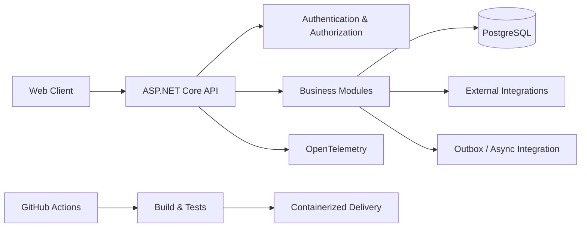

# B2B/B2C SaaS Orders Platform — Architecture Case Study

## Context

This case study describes the architecture of a private SaaS platform for managing commercial operations across multiple organizations.

The product centralizes workflows such as customers, catalog, proposals, orders, payments, commissions and operational controls while preserving strict tenant isolation and authorization boundaries.

The source code remains private. This document exposes only **portfolio-safe architectural information**.

## Engineering goals

The platform was designed around a few core concerns:

- isolate data and permissions between organizations;
- keep business rules authoritative on the backend;
- support secure authentication and authorization;
- make financial operations idempotent and auditable;
- support incremental evolution without coupling every module together;
- provide production-oriented observability and health validation;
- maintain automated test coverage across backend and frontend behavior.

## High-level architecture

## Main stack

| Area | Technology |
| --- | --- |
| Backend | .NET 10, ASP.NET Core Minimal APIs |
| Persistence | EF Core 10, PostgreSQL |
| Frontend | Vue 3, TypeScript, Vite |
| State | Pinia, TanStack Query |
| Security | ASP.NET Identity, MFA, organization-scoped authorization |
| Tests | xUnit, architecture tests, Vitest, Playwright, Testcontainers |
| Integrations | Payments, object storage, external business APIs |
| Observability | OpenTelemetry / OTLP |
| Delivery | Docker, GitHub Actions |

## Multi-tenancy and authorization

A central architectural concern is ensuring that requests cannot cross organization boundaries.

The design uses organization context and authorization rules to make tenant isolation part of the application model rather than an optional convention.

Authorization is modeled beyond simple roles, incorporating both **permissions** and **data scope**, allowing rules such as:

- access only to data created by the current user;
- access to a team scope;
- access to the whole organization.

## Financial consistency

Financial operations require stronger guarantees than ordinary CRUD.

The architecture therefore emphasizes:

- backend-authoritative calculations;
- immutable financial snapshots where appropriate;
- idempotent processing;
- optimistic concurrency;
- auditability;
- asynchronous integration patterns for side effects.

## Security principles

Security-sensitive capabilities are designed to fail closed when required infrastructure is unavailable or misconfigured.

The platform also includes controls such as:

- MFA;
- session revocation;
- organization-aware access control;
- protections against cross-tenant resource access;
- startup validation for required production configuration.

## Testing strategy

The test strategy spans multiple levels:

- unit/business-rule testing;
- architecture tests;
- integration tests against disposable infrastructure with Testcontainers;
- frontend component tests;
- end-to-end scenarios with Playwright.

## Observability and operations

Production readiness includes:

- health checks;
- OpenTelemetry instrumentation;
- containerized execution;
- startup configuration validation;
- repeatable CI pipelines.

## Engineering lessons demonstrated

This project is particularly representative of my current direction as a **Senior .NET Software Engineer** because it combines:

- backend engineering;
- software architecture;
- product requirements;
- security;
- distributed integration concerns;
- automated testing;
- observability;
- delivery automation.

The emphasis is not only on implementing features, but on designing software that remains **maintainable, secure and evolvable as the product grows**.
