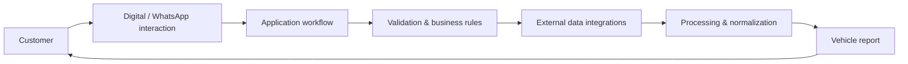

# ProcedeAuto — Vehicle Information Automation Case Study

## Product context

[ProcedeAuto](https://procedeauto.com.br/) is a digital product focused on automating access to vehicle information and provenance checks.

I participate in the product as **partner and software developer**, combining engineering work with product and business decisions.

This public case study intentionally omits proprietary code, credentials, providers and sensitive integration details.

## Problem

Vehicle-information workflows can involve multiple data sources, repetitive consultation steps and manual interaction.

The product goal is to transform that process into a simpler digital journey where the customer can request information through an accessible interface and receive the resulting report with minimal manual intervention.

## Product flow

## Engineering responsibilities represented by the project

The project demonstrates experience beyond isolated feature development:

- translating a manual/business workflow into software;
- designing customer-facing automation;
- integrating external services and data sources;
- processing and normalizing information from multiple sources;
- maintaining a production product;
- troubleshooting integrations and operational failures;
- evolving the solution based on business and user needs;
- balancing technical decisions with product constraints.

## Information workflow

The platform supports the generation of vehicle-information reports covering items such as:

- vehicle registration information;
- chassis and engine information;
- auction history;
- accident / claim indicators;
- theft or robbery information;
- market-reference information such as FIPE.

## Why this matters as an engineering case

ProcedeAuto gives me direct exposure to **product ownership**.

Instead of receiving only a predefined technical task, the work involves understanding:

1. what the user needs;
2. how the business process operates;
3. which steps can be automated;
4. how external integrations behave;
5. how failures affect the user journey;
6. how the product should evolve.

That combination strengthens the connection between **software engineering and business outcomes**.

## Engineering themes

**Product Engineering · APIs · Integrations · Automation · Digital Workflows · Reliability · Troubleshooting · Continuous Evolution**

## Product

https://procedeauto.com.br/
